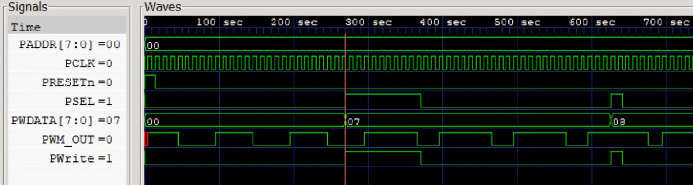

## Description
This project is a **Vivado demonstration** showcasing a **PWM-based DC motor and LED control system** implemented on the **Arty A7 FPGA**.

The PWM controller is written in **Verilog**, simulated using **Icarus Verilog and GTKWave**, and synthesized in **Vivado**. It is integrated with the **RISC-V ET1035 SoC** through port mapping, making it accessible via a memory-mapped register.

Once programmed onto the FPGA, the **RISC-V processor** writes duty cycle values to the PWM register using a **C program compiled with the Vega SDK**. These values directly update the PWM hardware, controlling **LED brightness** and **DC motor speed** in real time.

This project demonstrates **hardware-software co-design**, combining **RTL design, embedded programming, SoC integration, and FPGA prototyping**.

---

## PWM Duty Cycle Behavior

| Duty Cycle (%) | LED Brightness  | DC Motor Speed |
| -------------- | --------------- | -------------- |
| 0%             | OFF             | Stopped        |
| 30%            | Dim             | Slow           |
| 50%            | Medium          | Moderate       |
| 70%            | Bright          | Fast           |
| 100%           | Full Brightness | Maximum Speed  |

---

## Requirements
- **Arty A7 FPGA Board (100T)**
- **Vivado 2024.1** ([User Guide](https://hthreads.github.io/classes/embedded-systems/labs/assets/guides/VivadoGuide2024_1.pdf))
- **VEGA Tools SDK** (for RISC-V ET1035 compilation)
- **Tera Term** (Windows) or **Minicom** (Linux) for UART bootloader transfer
- **MicroUSB Cable** (for UART interface)
- **LEDs** and **DC Motor** connected to FPGA outputs

---

## Demo Setup

### Hardware
- Connect the **Arty A7** board to your PC via USB.
- Connect PWM output pins to an LED and a DC motor driver.

### Software
- **Vivado** (run the TCL script to generate the project `.xpr`)
- **Vega SDK + Makefile** (to build the RISC-V `.bin`)
- **UART Terminal** (Tera Term / Minicom) for bootloader transfer

---

# Steps to Run the Demo

## 1. Generate Vivado Project from TCL Script

- Open **Vivado 2024.1**.  
- In the **Tcl Console**, run the following command:  
> ⚡ Example:
```text
source ./scripts/create_project.tcl
```
## 2. Build the Bitstream
- Open the generated project in **Vivado**.  
- Click **Generate Bitstream**.  
- Program the FPGA with the `.bit` file: 
> ⚡ Example :
```text
./vivado_proj/ET1035_PWM.runs/impl_1/PWMdemo.bit
```

## 3. Compile RISC-V Program Using Makefile
- Navigate to the `Software` folder:
folder:  
> 📂 Example :
```text
 cd sw
```
- Ensure the PWM base address (assigned during port mapping in hardware) is correctly defined in:

  - **config.h** → ccontains memory map (e.g., '#define PWM_BASE_ADDR 0x10400000') 
  - **pwm.h** →wraps the PWM register structure with '#define pwm_reg (*((volatile PWM_REG*)(PWM_BASE_ADDR)))'
    

  - **pwm.c** → contains functions (e.g., `pwm_set_duty(int value)`) that write duty cycle values to the mapped register
    > ⚡ Example :
    ```text
    typedef struct {
    unsigned int DUTY_CYCLE;
    } PWM_REG;
    #define pwm_reg (*((volatile PWM_REG*)(PWM_BASE_ADDR)))
    ```
- Once configuration files are correct, run:  
 > 🛠️ Example :
```text
make
```

This compiles all sources (`main.c`, `pwm.c`, `uart.c`) and links them with Vega SDK libraries.  
- The final RISC-V binary will be generated as:  

 > 💾 Example :
```text
    pwm_test.bin
```

## 4. Load Program via UART Bootloader  

- Open a UART terminal (e.g., **Tera Term**/ **Minicom**) at `115200` baud.  
- Reset the FPGA → Bootloader banner will appear.  
- Select **Send File → XMODEM → pwm_test.bin**.  
- The bootloader copies the program into program memory.  
- Execution starts automatically, and **PWM duty cycle control** begins.  

## 5. Observe the Output  

- **LED brightness** changes smoothly as duty cycles update.  
- **DC motor speed** varies in proportion to PWM values.
# Additional Notes
  ## Generating Bitstream and Programming the FPGA
  - Launch Vivado 2024.1 and open the project by double-clicking the XPR file located at "<archive extracted location>/vivado_proj/Arty-A7-100-XADC.xpr".
  - In the Flow Navigator panel on the left, click Open Hardware Manager.
  - Connect the Arty A7-100T to your computer using a MicroUSB cable.
  - On the green bar at the top, click Open Target and select Auto Connect from the dropdown menu.
  - Next, click Program Device on the green bar.
  -In the Program Device Wizard, specify the bitstream file as "<archive extracted location>/vivado_proj/Arty-A7-100-XADC.runs/impl_1/XADCdemo.bit" and click Program.
  - The Arty A7-100T will now be programmed with the demo.

# Results
## 1.PWM Simulation Results


The designed PWM module was initially verified through simulation prior to FPGA implementation. Using Icarus Verilog for simulation and GTKWave for waveform visualization, both the PWM counter and duty cycle functionality were thoroughly checked. The resulting waveforms clearly demonstrated that the PWM signal toggled correctly according to the expected duty cycle variations, confirming accurate register updates and proper logic operation

## 2. PWM Output Validation on Oscilloscope

The Verilog-based PWM module was integrated into the RISC-V ET1035 SoC and deployed on the Arty A7 FPGA. The output waveform was examined using a cathode ray oscilloscope (CRO). By modifying the duty register through the C program, different duty cycles were generated. The oscilloscope traces confirmed the expected pulse-width variations, validating the correct operation of the hardware PWM design.

## 3. LED Brightness Control using PWM

The PWM output was connected to an LED on a breadboard. By modifying the duty cycle through C code executed on the RISC-V processor, the LED’s brightness was controlled in real time. Higher duty cycles produced greater brightness, while lower duty cycles dimmed the LED. This experiment demonstrated effective hardware-software integration and validated real-time PWM-based control.

### Demo Video
  [Watch Video](Results/LED_Brightness_Control_Demo.mp4)

## 4. DC Motor Speed Control using PWM

The PWM output was connected to an L293D motor driver to control a DC motor. Adjusting the duty cycle from the processor varied the average voltage applied to the motor, resulting in different rotational speeds. Higher duty cycles made the motor run faster, while lower duty cycles slowed it down, demonstrating the practical applicability of the designed PWM module in real-time embedded systems.

### Demo Video
   [Watch Video](Results/DC_Motor_FPGA_demo.mp4)

## 5. Smart Street System
Beyond verifying PWM operation on the oscilloscope, LED, and DC motor, the project was extended to a practical application: a Smart **Street Monitoring System**. In this system, an **IR sensor**detected vehicle presence, while an **LDR sensor** measured ambient light levels. The RISC-V processor continuously read the sensor values through GPIO, processed the conditions, and adjusted the PWM duty cycle accordingly. The PWM output was then used to control the brightness of streetlights:

- **Obstacle detected** + **no light** → 100% duty cycle (LED fully ON for maximum brightness).

- **Obstacle detected** + **sufficient light** → 70% duty cycle (LED partially ON).

- **No obstacle** + **light present** → 30% duty cycle (LED dim to save power).

- **No obstacle** + **no light** → 50% duty cycle (LED in standby brightness).

This implementation demonstrates how the designed PWM hardware can be incorporated into a real-time embedded control system. By integrating **Verilog-based PWM logic, RISC-V processor control, and sensor feedback**, the project presents a complete **hardware-software co-design** solution for energy-efficient streetlight monitoring.

### Demo Video
   [Watch Video](Results/Smart_Street_Light_Demo1.mp4)
